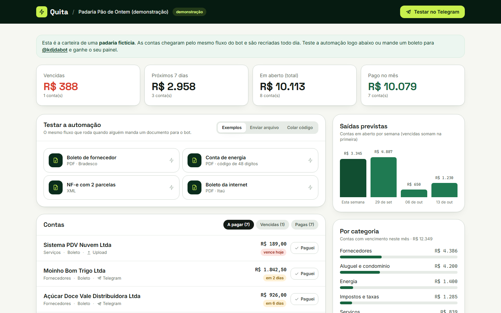

# ZYRO · contas a pagar no automático

      

**🔗 Demo ao vivo: [quita-contas.vercel.app](https://quita-contas.vercel.app)** · simulação no Gmail: [/gmail](https://quita-contas.vercel.app/gmail) · ligar no seu Gmail: [/conectar](https://quita-contas.vercel.app/conectar) · painel de exemplo: [/demo](https://quita-contas.vercel.app/demo) · bot: [@kdjdabot](https://t.me/kdjdabot)



Automação de contas a pagar para pequenos negócios (e para a conta de casa). **Chegou a conta no Gmail, o ZYRO agenda o aviso**:

1. um script do Google roda **no Gmail da própria pessoa** e, a cada 10 minutos, manda para o ZYRO só os e-mails com cara de conta (boleto, fatura, nota fiscal);
2. o ZYRO **lê** o anexo (PDF ou XML da NF-e) ou o código no texto do e-mail;
3. **encontra e valida** a linha digitável ou a chave da NF-e pelos dígitos verificadores e extrai **valor, vencimento, banco e fornecedor**;
4. **nunca faz duas vezes**: o mesmo e-mail só é lido uma vez, e a mesma conta chegando em outro e-mail (reenvio, lembrete da empresa com o código no corpo) é reconhecida pela impressão digital do código;
5. **agenda os avisos**: X dias antes, no dia e no dia seguinte. Às 8h, o script manda o aviso **do Gmail da pessoa para ela mesma**, e o app do Gmail notifica no celular e no computador. Cada aviso sai uma vez só;
6. tudo aparece num **painel pessoal**: contas, próximos avisos, previsão de saídas, gastos por categoria e o **histórico de execuções**, passo a passo, como no n8n.

O mesmo robô também atende pelo **Telegram** (encaminhe o boleto para o bot, receba os avisos com botão "💸 Marcar como paga").

- Site: `/` · **Simulação visual**: `/gmail` · Ligar no Gmail: `/conectar` → `/p/{token}/gmail` · Painel da padaria fictícia: `/demo` · Painel pessoal: `/p/{token}`
- Documentos de exemplo, gerados na hora e sempre com vencimento futuro: `/api/exemplos/{boleto-moinho|conta-energia|nfe-laticinios|boleto-internet}` (`?dias=N` define o vencimento)

## A simulação (`/gmail`)

Uma caixa de entrada de mentira com e-mails de verdade. Cada visitante ganha uma carteira de simulação (apagada em um dia) e os e-mails passam pelo **mesmo caminho** de um e-mail real:

- conta de luz, boleto de fornecedor, NF-e em 2 parcelas, boleto de internet → **aviso agendado**;
- o mesmo boleto reenviado e o lembrete da empresa com o código no corpo → **repetida · ignorada**;
- propaganda → **não é conta** (nem entra no histórico).

Um relógio simulado ("pular para o próximo aviso") mostra os avisos chegando: e-mail do ZYRO na caixa, notificação no celular e alerta no computador. "Marcar como paga" cancela os avisos seguintes.

## Por que um script do Google e não "Entrar com Google"

| | Script do Google (usado) | OAuth "Entrar com Google" |
| --- | --- | --- |
| Acesso ao Gmail | roda na conta da pessoa; o ZYRO nunca vê senha nem token | escopo restrito do Gmail exige verificação do Google (auditoria paga) ou limite de 100 usuários de teste |
| Enviar o aviso | `GmailApp.sendEmail` para a própria pessoa: sem domínio, sem serviço de e-mail | precisa de domínio próprio + serviço de envio |
| O que sai da caixa | só e-mails que batem com a busca (anexo PDF/XML, "boleto", "fatura", "linha digitável"…) | a caixa inteira fica acessível |
| Desligar | apagar o script | revogar o acesso na conta Google |

O script é gerado com a chave da carteira (`chave_gmail`, 192 bits, diferente do link do painel) e chama `/api/gmail/receber`, `/api/gmail/avisos` e `/api/gmail/ping`. Os avisos por e-mail usam uma **janela**: a conta que chega 2 dias antes do vencimento, com antecedência de 3, ainda recebe "vence em 2 dias" no mesmo dia.

---

## Por que não usa IA para ler o boleto

A linha digitável **já carrega os dados**, protegidos por dígitos verificadores. O ZYRO decodifica tudo de forma determinística (`src/lib/codigos.ts`):

| Documento | Tamanho | O que sai do código | Validação |
| --- | --- | --- | --- |
| Boleto bancário | 47 dígitos | banco, valor, vencimento (fator) | módulo 10 em cada campo + módulo 11 geral |
| Arrecadação (água, luz, telefone, tributos) | 48 dígitos, começa com 8 | segmento → categoria, valor, vencimento quando embutido | módulo 10 ou 11 por bloco, conforme o identificador |
| Chave da NF-e | 44 dígitos | UF, mês de emissão, CNPJ do emitente, número | módulo 11 |
| XML da NF-e | — | emitente, total e **cada duplicata** (vencimento e valor) | estrutura do XML |

Detalhes que costumam passar despercebidos:

- **O fator de vencimento reiniciou em 22/02/2025** (chegou a 9999 e voltou a 1000). O mesmo fator vale para duas datas separadas por 25 anos, e o ZYRO escolhe a mais próxima de hoje.
- Um documento impresso junta números vizinhos ("Pedido 2026 000123"). A busca testa janelas deslizantes e só aceita códigos com todos os DVs corretos. Em 2.000 boletos aleatórios, **zero falsos positivos** (há teste para isso).
- A IA (Groq, camada gratuita, opcional) entra só para **dar nome ao fornecedor** quando o layout não tem o rótulo "Beneficiário". **Nunca decide valor nem data.**

## Arquitetura

```
Gmail (Apps Script, a cada 10 min) ─► /api/gmail/receber ─┐
Telegram ──webhook──► /api/telegram ────────────────────────┤
Painel (upload/exemplo/texto) ──────────────────────────────├─► pipeline.ts ──► Supabase (schema "contas")
Simulação /gmail ──► /api/simulacao/email ──────────────────┘   Receber → Ler → Encontrar → Validar →
                                                                Enriquecer → Deduplicar → Salvar e agendar
Gmail (Apps Script, de hora em hora) ◄── /api/gmail/avisos      (avisos por e-mail, confirmados um a um)
Telegram ◄── /api/agendador (Vercel Cron, 8h)                   (lembretes, resumo semanal, limpeza das simulações)
```

- **Next.js 15** (App Router, Route Handlers), **unpdf** para o texto do PDF, **fast-xml-parser** para NF-e e **pdf-lib** para gerar os exemplos (boleto com código de barras Intercalado 2 de 5 de verdade).
- **Telegram Bot API** via HTTPS puro: webhook com `secret_token`, botões inline e callbacks.
- **Google Apps Script** (`src/lib/script-gmail.ts`): busca no Gmail, rótulo `ZYRO` nas conversas lidas, gatilhos de 10 min e 1 h, envio do aviso com `GmailApp`.
- **Vercel Cron** diário (`vercel.json`): lembretes do Telegram, resumo às segundas, recriação da carteira demo e limpeza das simulações.
- Nenhum aviso sai duas vezes: tabela `lembretes` com chave (conta, tipo, canal); e-mails lidos na tabela `emails` com chave (carteira, id do Gmail).

### Segurança

- Tabelas no schema **`contas`, fora da API REST** do Supabase. O acesso é só pelas funções `public.contas_*`, que exigem um segredo do servidor (`CONTAS_SEGREDO`), que nunca vai ao navegador.
- **Script do Gmail** se autentica com `Bearer chave_gmail`; o texto do e-mail não é guardado (só assunto e remetente dos que traziam conta).
- **Webhook** aceita apenas requisições com o cabeçalho `X-Telegram-Bot-Api-Secret-Token`. O **agendador** aceita apenas `Authorization: Bearer CRON_SECRET`.
- **Painel pessoal** por token de 144 bits, `noindex` e `no-referrer`.
- Cada conversa no Telegram é uma carteira isolada. Os botões só alteram contas da própria carteira.

## Como rodar

```bash
npm install
# banco: aplique supabase/migrations/*.sql num projeto Supabase e gere o segredo:
#   insert into public.segredos values ('contas', encode(gen_random_bytes(32), 'hex'));
cp .env.example .env.local        # Supabase, CONTAS_SEGREDO, TELEGRAM_BOT_TOKEN, TELEGRAM_WEBHOOK_SEGREDO, CRON_SECRET, APP_URL
npm run dev                       # http://localhost:3300
npm test                          # códigos de boleto, arrecadação, NF-e, busca em texto e categorias

# depois de publicar:
node scripts/configurar-telegram.mjs https://SEU-DOMINIO   # webhook, comandos e descrição do bot
```

## Limitações

- **Foto de boleto** não é lida (sem OCR). O bot pede o PDF ou a linha digitável colada, que é o que dá 100% de precisão.
- Contas de arrecadação **sem vencimento embutido** entram marcadas "conferir".
- O script só olha a **caixa de entrada** dos últimos 15 dias: conta arquivada automaticamente por filtro fica de fora.
- Na primeira execução o Google mostra "app não verificado" (o script é da própria pessoa): é preciso clicar em Avançado → Acessar.
- **WhatsApp** entraria como mais um canal no mesmo esquema de avisos por canal.
